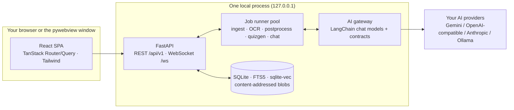

<div align="center">


# Study Assistant
### Local-first, AI-powered study workbench

[](https://github.com/neuronection/study-assistant/releases)
[](docs/STATUS.md)
[](LICENSE)
[](#quick-start)
[](https://fastapi.tiangolo.com/)
[](https://react.dev/)
[](https://sqlite.org/)

**Repository**: [neuronection/study-assistant](https://github.com/neuronection/study-assistant)

</div>

> **Your material stays on your machine.** One local process, one SQLite database, no accounts
> and no cloud — the only traffic leaving your machine is the AI calls you configure yourself.

---

## Table of contents

- [What is Study Assistant?](#what-is-study-assistant)
- [What's different](#whats-different)
- [Features](#features)
- [Math you can trust](#math-you-can-trust)
- [Quick start](#quick-start)
- [Architecture at a glance](#architecture-at-a-glance)
- [Documentation](#documentation)
- [Tech stack](#tech-stack)
- [Scope & limitations](#scope--limitations)
- [Status & roadmap](#status--roadmap)
- [Contributing](#contributing)
- [License](#license)

---

## What is Study Assistant?

A local desktop/web app for turning the study material you already have — PDFs, scans,
photos, markdown notes — into structured courses and active practice. It ingests your
files, OCRs them into searchable markdown (with proper math), drafts a course outline,
and generates quizzes, exercises, flashcards, and cheat sheets from *your* material.

Under the hood it is a math-first workbench: typed math answers are graded by a
deterministic equivalence chain (`2x` counts as `x*2`), hints are guaranteed by code
never to leak the answer, and the tutor chat can call real CAS tools (SymPy) mid-answer.
It is math-first (built around calculus) but subject-agnostic by design — the same
pipeline works for any course material.

It is **in-development** software, built for technical students first.

## What's different

- **Local-first, not cloud-first.** One local FastAPI process with SQLite (FTS5 +
  sqlite-vec) and a content-addressed blob store. No accounts, no sync, no telemetry.
  Delete the data folder and the app is gone.
- **The AI assists — your record stays yours.** Chat and generators are grounded in your
  material with citations; the AI proposes actions (create a note, cover a concept,
  generate a quiz) through review cards you approve — it cannot write into your course
  on its own.
- **Bring your own LLM.** Google Gemini, Anthropic, OpenAI, any OpenAI-compatible
  endpoint (including a local Ollama). Per-task model assignment: pin one model to OCR,
  another to chat, another to quiz generation.
- **Math answers aren't string-matched.** A deterministic equivalence chain grades typed
  math semantically, and a code-enforced leak guard proves hints never reveal the answer.

## Features

### Bring your material in

- **Upload anything** — PDFs (text layer or scanned), images, markdown. Scanned pages go
  through an OCR pipeline into searchable markdown with LaTeX math and diagrams.
- **Side-by-side QA editor** — fix OCR mistakes in a rich Tiptap editor (tables, links,
  math round-trip byte-identically); every fix re-syncs search and embeddings.
- **A Nemo-style library** — per-course folder trees, linked folders, cut/copy/paste,
  marquee selection, drag-to-folder, inline text/markdown creation.
- **Versioned extractions** — originals are kept forever in a content-addressed blob
  store; every extraction keeps its history, deduplicated by content hash.
- **Hybrid search** — keyword (FTS5) + semantic (sqlite-vec) fused with RRF, plus a
  typo-tolerant fuzzy tier. Interactive mindmaps and hand-drawings are first-class
  citizens: drawing OCR joins the search index.

### Structure a course

- **AI outline** — draft a chapter/section structure from your material's index cards,
  review and edit, commit. Manual assignment with confidence shown per suggestion.
- **Unified node tree** — one course tree (≤4 levels) instead of rigid chapters; every
  material, note, quiz, exercise, and chat session is placed on a node.
- **Node workspace** — overview, materials, notes, concepts, practice, and tutor tabs
  for the course root and every node, with a clickable structure sidebar and study
  telemetry (progress rings, due-card badges).
- **Concepts & knowledge graph** — per-course concept graphs with coverage per node and
  a weakness matrix linking concepts to skills.

### Practice until it sticks

- **Quizzes** — generated from your material with question-type control and shuffling;
  instant deterministic grading; export/import (`.qpkg`) and print; focus topics and
  skills for targeted sessions.
- **Exercises** — multi-step problems with a 1–5 hint ladder that never reveals the
  answer (enforced by code), similar-exercise variants, and error-pattern drills grown
  from your own mistake notebook.
- **Flashcards** — FSRS-scheduled review with due counts surfaced in the course tree;
  Anki (`.apkg`) export.
- **Free-form, too** — explain / spot-the-error / correct-the-solution exercises graded
  by an AI rubric with rationale feedback.

### Notes & handwriting

- **Markdown notes** with KaTeX math, mermaid diagrams, tables, and an infinite
  handwriting canvas (zoom-to-cursor, crop-on-save, re-runnable OCR).
- **Inline AI helper** — a ✨ button in every editor: transform presets, free-form
  prompts, streamed preview, and human-gated insertion.
- **Dictation** — record a clip in the editor or chat composer; your provider's
  speech-to-text transcribes it at the cursor.

### A tutor grounded in your material

- **Chat with citations** — answers are grounded in your courses with numbered sources
  and token streaming; ask about a node and the context is scoped to it.
- **Real tools mid-answer** — the tutor can call a sandboxed calculator and SymPy
  (solve, diff, integrate, …) and shows every tool call as an expandable card.
- **Mentions & attachments** — reference materials, notes, quizzes, and nodes by handle;
  branch a conversation into a tree and regenerate any turn.
- **Human-in-the-loop proposals** — "create a note", "cover this concept", "generate a
  quiz here" arrive as cards you approve; execution is revalidated at approve time.

### Understand your progress

- **Today screen** — streak, daily goal ring, due reviews, 90-day heatmap, and
  next-best-action cards with evidence and one-tap actions.
- **Diagnostics** — weakness matrix (concepts × skills), speed–accuracy quadrants, item
  analysis that flags bad questions, and an error-pattern profile.
- **Scores history & mistake notebook** — every attempt with score coloring; mistakes
  tagged by error type and feeding the drill generator.

### Private by default

- **Loopback only** — the server binds `127.0.0.1`; nothing is externally exposed.
- **Keys in the OS keyring** — API keys never touch the database, files, or logs; masked
  in every response.
- **Automatic backups** — a validated full archive (snapshot DB + blobs + manifest) on a
  schedule with daily/weekly retention, boot-time integrity checks and auto-recovery;
  manual export/restore included.
- **Read-only MCP server** — expose your courses to external AI agents over stdio MCP;
  no write tools.

## Math you can trust

Study Assistant is built math-first, so trust is engineered rather than promised:

- **Deterministic grading** — typed answers go through an equivalence chain (Sympy-backed
  semantic equivalence, normalization, multiple accepted forms). `2x` vs `x*2` is
  correct; distractor→misconception tags explain *how* you were wrong.
- **Hint leak guard** — a code-level guard proves every hint is not answer-equivalent
  before it is shown; the ladder never skips levels, and every hint is audited.
- **CAS in the loop** — the tutor's SymPy tool results are computed, not hallucinated,
  and are shown to you as tool cards.
- **Honest AI text** — AI-generated material is labeled (`ai-draft`, `AiBadge` in the
  library), and AI grading of free-form answers always carries a rationale.

## Quick start

### Run from source (Linux/macOS/Windows)

Prerequisites: **Python 3.12+** with [uv](https://docs.astral.sh/uv/), **Node 20+** with
pnpm (`corepack enable pnpm`). On Linux the desktop shell additionally needs GTK build
headers:

```bash
sudo apt install libgirepository-2.0-dev libcairo2-dev
```

```bash
git clone https://github.com/neuronection/study-assistant.git
cd study-assistant
uv sync                                   # backend venv (repo root)
corepack enable pnpm && pnpm install      # frontend
pnpm webapp                               # build + serve + open http://127.0.0.1:8000
```

`pnpm webapp` (recommended) serves the built app in your browser; `pnpm dev` runs
uvicorn + Vite with hot reload on `localhost:5173`; `pnpm app` opens the pywebview
desktop window. All modes accept `--reset` to wipe local data. Override the port with
`SA_PORT`.

### Connect an AI provider

AI features need at least one provider: open **Settings → Providers → Add provider**
(Google Gemini, OpenAI, Anthropic, Ollama, or any OpenAI-compatible endpoint), paste your
API key — it goes into your OS keyring — then assign default models per capability
(text / vision / embeddings) in **Tasks**. OCR needs a vision-capable model; without
embeddings, search falls back to keyword-only. Details in the
[getting started guide](docs/usage/getting-started.md).

## Architecture at a glance



The frontend talks only REST + WebSocket, which keeps the window shell replaceable
(pywebview today, browser mode daily, Tauri a future option) without touching app code.
Background work (OCR, embeddings, generation, chat turns) runs in a durable job pool
with progress streamed over WebSocket. Only AI calls leave the machine.
Deep dive: [docs/architecture.md](docs/architecture.md).

## Documentation

**Getting started**
- [Getting started](docs/usage/getting-started.md) — launch modes, provider setup, the study loop
- [Courses & structure](docs/usage/courses.md) — outlines, node tree, the workspace
- [Library](docs/usage/library.md) — uploads, folders, linked sources
- [Sources & profiles](docs/usage/sources-and-profiles.md)

**Everyday use**
- [Notes](docs/usage/notes.md) · [Flashcards](docs/usage/flashcards.md) · [Quizzes](docs/usage/quiz.md) · [Exercises](docs/usage/exercises.md)
- [Tutor chat](docs/usage/chat.md) · [Progress & analytics](docs/usage/progress.md) · [Activity & jobs](docs/usage/activity.md)
- [Backup & restore](docs/usage/backup.md) · [Skills](docs/usage/skills.md)

**Platform**
- [Architecture](docs/architecture.md) — layout, runtime behavior, security posture
- [Feature catalog](docs/features.md) — everything, as built
- [Math verification](docs/math-verification.md) — the equivalence chain and leak guard
- [AI layer](docs/ai.md) · [Data model](docs/data-model.md) · [Import/export](docs/import-export.md)
- [Packaging](docs/usage/packaging.md) — deb / AppImage / Windows exe
- [Current status](docs/STATUS.md) — single source of truth for what exists

## Tech stack

| Layer | Technology |
|---|---|
| Backend | FastAPI (Python 3.12+), SQLAlchemy 2, Pydantic v2, Alembic, structlog |
| Frontend | React 19 + Vite + TypeScript (strict) + Tailwind 4, TanStack Router/Query, Zustand |
| Editor | Tiptap, KaTeX, MathLive, mermaid |
| Visualization | Plotly.js charts, JSXGraph geometry (lazy-loaded) |
| AI | LangChain chat models behind one gateway — Google, OpenAI-compatible, Anthropic |
| Storage | SQLite (WAL) + FTS5 + sqlite-vec, content-addressed blob store |
| Desktop shell | pywebview (WebKitGTK / WebView2 / WKWebView) |
| Packaging | PyInstaller, deb + AppImage, tag-driven release workflow |
| Tooling | uv + pnpm workspaces, ruff + mypy + pytest, eslint + vitest |

## Scope & limitations

Honest boundaries — not every limitation is a bug:

- **From source today.** Prebuilt installers (deb, AppImage, Windows exe) arrive with
  the first tagged release; Linux packaging is verified locally, the Windows build
  awaits its first CI run.
- **Browser-first.** The pywebview desktop shell has a rendering issue on some setups;
  `pnpm webapp` is the recommended mode for now.
- **Single user, single machine.** Loopback-only server, one local profile — no
  accounts, no sync, no mobile app.
- **AI features need a provider.** OCR and note transcription need vision/speech-capable
  models; semantic search needs an embeddings model, else it is keyword-only.
- **AI text needs review.** Graded math and hints are deterministic; AI-written material
  and AI-graded free-form answers are labeled as such and should be reviewed.
- **English UI.** The i18n harness exists; only the English catalog is complete.

## Status & roadmap

`docs/STATUS.md` is the single source of truth for phase and module status. Headline
next steps: the first tagged release (artifacts for Linux + Windows), golden OCR eval
fixtures, and the post-1.0 backlog (local OCR adapter, Tauri shell, audio/video
ingestion, plugins, graph-sketch grading).

## Contributing

Contributions are welcome. Set up a dev environment via
[Quick start](#quick-start), then run the verification suite before every commit:

```bash
pnpm verify:backend                       # ruff + mypy + pytest
pnpm verify:frontend                      # eslint + tsc + vitest + build
```

Docs are part of the change: `docs/STATUS.md` is updated in the same commit as any
behavior change (see `AGENTS.md` for the workflow).

## License

Apache License 2.0 — see [LICENSE](LICENSE) for details.
