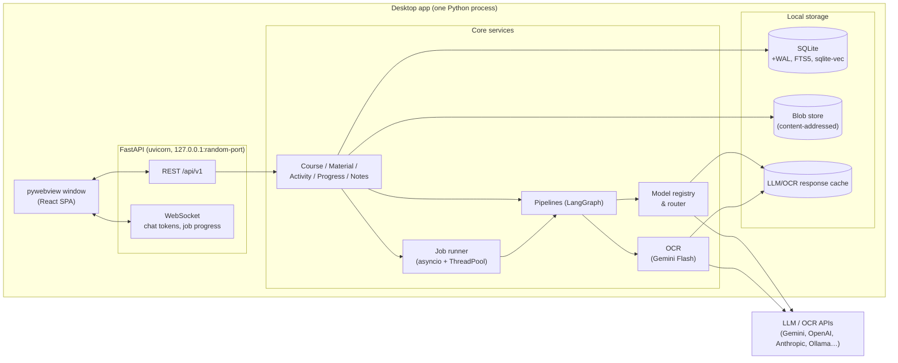

# 02 — System Architecture

## High-level picture



Single local process. The frontend talks **only** REST + WebSocket — the window shell is
replaceable (pywebview → Tauri → plain browser during development) without touching app code.

## UI shell decision (answers "React?")

**React 18 + TypeScript + Vite** is the right call — unmatched ecosystem for the pieces we
need (equation editors, diagram renderers, canvas, virtualized trees).

For the desktop shell, **pywebview** (recommended for MVP):

| Option | Verdict |
|---|---|
| **pywebview** | Pure-Python launch, tiny, uses system WebView (WebKitGTK/WebView2/WKWebView). `python -m courseassistant` just works. ✅ **MVP choice** |
| Tauri 2 + Python sidecar | Better packaging/windowing, smaller & more polished binaries; needs Rust toolchain. Keep as **post-1.0 migration** option. |
| Electron | Heavy (ships Chromium + Node). Reject. |
| NiceGUI / Streamlit | Python-first but not React, weak for rich editors. Reject. |

Risk to test early: WebKitGTK rendering quirks on Linux (KaTeX/Mermaid/canvas) — validated in Phase 0.

## Tech stack

### Backend (Python 3.12+)

| Concern | Choice | Notes |
|---|---|---|
| API framework | FastAPI + Uvicorn | async, Pydantic v2, WebSocket, OpenAPI docs for dev |
| Orchestration | **LangChain + LangGraph** | graphs for multi-step pipelines; chains/tools/retrievers for primitives |
| DB | SQLite via **SQLAlchemy 2** + Alembic | WAL mode; single-writer app |
| Full-text | SQLite **FTS5** | BM25 over extractions/notes |
| Vectors | **sqlite-vec** | same DB file, zero extra services |
| PDF | PyMuPDF (fitz) | text layer + rasterization |
| Images | Pillow, OpenCV (preprocessing), imagehash (dedup) |
| OCR/vision | **Gemini 2.5 Flash** (google-generativeai / langchain-google-genai) | fallback adapter interface → local PaddleOCR later |
| Math | SymPy | answer equivalence, step verification, solver tools |
| SRS | py-fsrs (FSRS algorithm) | flashcards & concept review scheduling |
| Jobs | in-process asyncio queue + `jobs` table | durable, resumable, progress events |
| Config | pydantic-settings + OS **keyring** for API keys |
| Resilience | tenacity (retries/backoff), structlog, diskcache (LLM response cache) |
| Tooling | ruff, mypy (strict), pytest, pre-commit |

### Frontend (React + TS + Vite)

| Concern | Choice |
|---|---|
| Routing / data | TanStack Router, TanStack Query |
| UI state | Zustand |
| Styling / components | Tailwind CSS + shadcn/ui |
| i18n | i18next + react-i18next (**English-only v1**; all strings keyed from day 1, lint-enforced) |
| Rich text (notes) | Tiptap (extensions: math, mermaid, tables, code) |
| Equation input | **MathLive** (WYSIWYG LaTeX) |
| Math rendering | KaTeX |
| Diagrams | Mermaid |
| Charts | Plotly (react-plotly.js) |
| Geometry | JSXGraph |
| Drawing/sketch | Excalidraw-style canvas built on **perfect-freehand** (MIT; stylus pressure); tldraw evaluated later |
| Motion / feel | **framer-motion** (layout + shared-element transitions), `prefers-reduced-motion` honored |
| Knowledge graph / mind maps | React Flow |
| E2E tests | Playwright |

## Backend module layout (hexagonal-lite)

```
backend/
  app/
    main.py                 # assembles app (migrations run + seed on startup)
    shell.py                # pywebview entrypoint (env de-snapping, private_mode off)
    api/                    # HTTP routers, WS handler, DTO schemas (deps.py)
    core/                   # config, logging, secrets (keyring), events (bus)
    domain/                 # SQLAlchemy models (single source for Alembic autogen)
    services/               # materials, folders, profiles, courses+outline, search,
                            # chat (RAG), grading, tutor (hints, independence)
    pipelines/              # ingest, postprocess (embed+describe), quizgen, chunking
    ai/                     # gateway (httpx adapters + SSE streaming), providers
                            # (discovery/assignment), embeddings, describe, tools
                            # (CALC/SYMPY), contracts/ (validator registry)
    math/                   # equivalence chain (G9), leak guard (G11)
    ocr/                    # base.py (OcrEngine), gateway_ocr.py (task-routed)
    storage/                # db (engine + vec0 load), blobs, fts, vectors
    jobs/                   # durable runner (jobs table, claim-based thread)
  alembic/                  # migrations 0001-0007
  tests/                    # unit + integration (fakes/mock transports)
  pyproject.toml
frontend/
  src/
    app/                    # router (TanStack)
    features/               # home, library, courses, chat, quiz, scores,
                            # exercises, settings, spike
    components/             # design system, block renderers, MathInput, layout
    lib/                    # api client, ws client, i18n
dev/
  notes.txt  plans/         # plans gitignored (local-only)
```

Deviation notes: `repositories/` folded into `services/` (SQLAlchemy used directly —
the indirection bought nothing at this scale); model routing is hand-rolled httpx
adapters (ADR-029) rather than LangChain; `math/` is a new top-level module because
the equivalence chain + leak guard are shared by grading, quizgen and the tutor.

## Runtime behavior

- **Startup**: bind FastAPI to `127.0.0.1:<free port>` → serve built SPA from `dist/` (prod) or
  proxy to Vite dev server (dev, hot reload) → open pywebview window pointing at it.
- **Profiles**: no-auth quick switcher (several learners, one machine); active profile id
  travels with every request; all user-content queries are profile-scoped. Machine-level
  config (providers/models/task assignments, blobs) is global.
- **Ingestion**: upload (file copied into blob store) or **linked-source scan** (file stays
  in place; only content hash + path recorded) → dedup by content hash → `ingest` job queued → pipeline runs
  (OCR calls offloaded to thread pool since providers are sync-friendly) → progress streamed on
  WS topic `jobs:{id}` → UI updates extraction view when done.
- **Chat**: WS; server streams tokens from LLM, then persists message with citations + usage.
- **Cache**: LLM/OCR responses cached by (model, normalized prompt, input hashes) → re-ingesting
  an unchanged page is free; quiz regeneration with same params is cheap.
- **Cost guard**: per-task budget caps in settings; jobs pause + notify when exceeded.

## Security & best practices

- API keys only in OS keyring (never in DB/files/env-committed files).
- Server binds loopback only; no external network exposure.
- Input validation everywhere (Pydantic), file-type sniffing via python-magic, upload size caps.
- Parameterized SQL only (SQLAlchemy core/ORM); no string-built queries.
- Structured logs without sensitive content; optional Sentry opt-in.
- Alembic migrations for every schema change; seed script + sample course.
- CI: ruff + mypy (strict) + pytest + vitest + eslint + Playwright smoke + prompt eval suite.

## Dev workflow

1. `uvicorn app.main:app --reload` + `pnpm dev` (Vite proxies `/api` and `/ws`).
2. `python -m courseassistant` runs the real desktop shell against built assets.
3. Migrations: `alembic revision --autogenerate` / `alembic upgrade head`.
4. Skills/prompts: system defaults seeded from `app/ai/skills/` into the DB; users edit
   versions in the Settings→Skills UI (doc 08); evals run in CI against system defaults.
