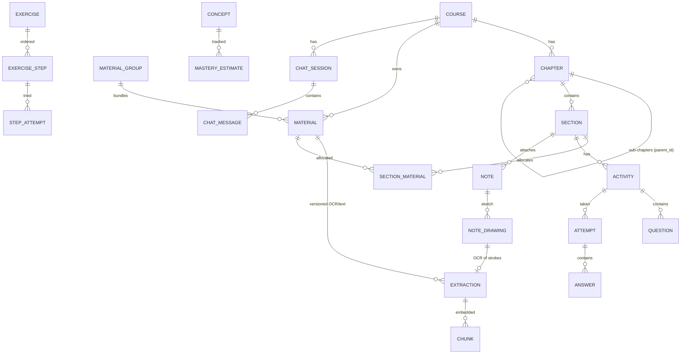

# 03 — Data Model

SQLite (WAL). All timestamps UTC ISO strings. Soft-delete (`deleted_at`) for user-facing
entities. JSON columns for flexible payloads. Alembic-managed.

## Entity overview



## Core content format — "blocks" (the interchange schema)

Every content surface (extraction body, question stem, explanation, note body, chat message)
is a **list of typed blocks** stored as JSON. UI renders per type; LLM layer serializes per
model capability (see 04 — OCR-first design).

```jsonc
[
  {"type": "text",     "md": "The chain rule states..."},
  {"type": "math",     "latex": "\\frac{dy}{dx}=f'(g(x))\\,g'(x)", "display": true},
  {"type": "diagram",  "mermaid": "graph TD; A-->B"},
  {"type": "chart",    "plotly": {"data": [...], "layout": {...}}},
  {"type": "image",    "blob": "sha256:...", "region": {"page": 3, "bbox": [x,y,w,h]},
                       "alt": "figure 2.1", "ocr_extraction_id": 42},
  {"type": "table",    "rows": [["x","y"], ["1","2"]], "caption": "values"},
  {"type": "code",     "lang": "python", "code": "..."},
  {"type": "geo",      "jsxgraph": "...construction script..."}
]
```

Rules: `image` blocks always carry (or inherit) a link to an OCR `extraction` — that link is
what makes text-only models work. Unknown block types are preserved and rendered as fallback.

## Tables

### Profiles (no authentication) & machine config
- **profiles**: id, name, color/avatar, created_at — quick switcher, no passwords; one
  default profile seeded on first run
- Scoping rule: user-content tables carry `profile_id` directly (courses, material_groups,
  materials, chat_sessions, flashcards, study_sessions, standalone notes, material_sources)
  or inherit it through their parent chain (sections→course, activities→section,
  attempts→activity, notes→owner…). Machine-level config is **global & shared**:
  blobs, providers, models, task_assignments.
- **settings** keys are scoped: `global` or `profile` (unique per scope+profile+key).

### Material sources (linked folders)
- **material_sources**: id, profile_id, label, path, recursive, include_globs(json),
  auto_ingest, scan_interval_sec (nullable → global default 300), enabled, last_scanned_at
- **materials** gains: source_id (nullable), external_path (nullable), file_mtime,
  file_size. Uploaded files → content lives in the blob store, no external_path. Linked
  files → stay in place on disk. **Scan loop** (periodic per source + on startup + manual):
  per file `stat` first — mtime+size unchanged → skip (no I/O beyond stat); changed →
  content hash → hash same (touch/rename) → refresh stored stat only; hash differs →
  offer / auto re-ingest as a **new extraction version**; file gone → mark `missing`
  (UI badge; re-link by hash offered).

### Courses & structure
- **courses**: id, title, description, subject, level, goals, tags(json), color, created_at, updated_at, archived_at
- **chapters**: id, course_id, parent_id (nullable, self-FK), title, order_idx, summary
  (materialized path `path` column for cheap subtree queries)
- **sections**: id, chapter_id, title, objectives(json blocks), summary, order_idx
- **concepts**: id, course_id, name, description, aliases(json) — extracted topics
- **concept_links**: from_concept_id, to_concept_id, relation (prereq-of, part-of, related-to)
- **section_concepts**: section_id, concept_id, weight

### Materials & extraction
- **blobs**: sha256 (PK), rel_path, size, mime, created_at — content-addressed originals
- **material_groups**: id, course_id, title, kind (image-set, page-set), order_idx
- **materials**: id, course_id (nullable → global library), group_id (nullable), kind
  (pdf, image, doc, md…), title, blob_sha, filename, mime, pages, language, status
  (pending/processing/ready/failed), content_hash, phash (images), created_at
- **extractions**: id, material_id, version, extractor (pymupdf | gemini-flash | …), model,
  blocks(json), markdown (flattened), confidence(json per-page), language, token_in/out, cost,
  reviewed, edited_by_user, created_at — **append-only versions; latest is current**
- **chunks**: id, extraction_id, ordinal, text, token_count
  (+ embedding in sqlite-vec virtual table keyed by chunk_id)
- **material_fts** (FTS5): title, markdown, description, topics — content-synced via triggers
- **material_index_cards**: material_id, summary, topics(json), key_terms(json), reading_minutes,
  difficulty (1–5) — the "quick search description" (regenerable)

### Sections ⇄ materials
- **section_materials**: section_id, extraction_id (nullable → material default), rationale,
  auto_assigned (bool), confidence

### Activities
- **activities**: id, section_id, type (quiz | exercise_set | flashcard_set), title, config(json),
  generated_from(json: prompt, params, material refs), created_at
- **questions**: id, activity_id, parent_id (nullable self-FK → sub-parts of composite
  questions C16, ordered), type (single | multi | truefalse | text | numeric | cloze |
  match | order | hotspot | equation | diagram_label | graph_read | composite | essay |
  table_fill | error_spot | numberline | graph_plot), stem(json blocks),
  options(json blocks), answer(json — normalized per type), explanation(json blocks),
  difficulty, bloom, skill (conceptual | procedural | applied | notation), concept_ids(json),
  expected_time_sec, curriculum_code, source_refs(json — chunks/materials generated from),
  distractor_misconceptions(json — option → error_tag), sympy_check(json: expected expr,
  free vars, tolerance, units, follow_through bool for composites), rubric(json —
  essay/proof C17, cells spec for table_fill C19, seeded_flaw for error_spot C20),
  input_modes(json — allowed modes, e.g. [type, write] for C18), tags(json),
  provenance(json: imported_from, generator, original_id),
  flag (ok | review | bad), stats(json: p_correct, attempts)
  — full metadata taxonomy: [10-analytics.md](10-analytics.md)
- **attempts**: id, activity_id, mode (practice | exam), started_at, finished_at, score,
  meta(json)
- **answers**: id, attempt_id, question_id, response(json blocks/values),
  input_mode (type | write | choose | draw — records C18 path), interpreted(json — final
  confirmed LaTeX/values after "interpreted as" chip), strokes_blob(nullable — original
  handwriting, kept for review/re-OCR), correct (bool/nullable),
  partial_credit, feedback(json blocks), graded_by (symPy | llm | manual),
  time_ms, retries, error_tags(json), confidence (nullable — optional self-rating),
  help_events(json:
  [{kind: hint|ask_chat|socratic, level, created_at}]) — feeds independence score,
  created_at

### Exercises & tutoring
- **exercises**: id, section_id, title, context(json blocks), difficulty, created_from
- **exercise_steps**: id, exercise_id, order_idx, prompt(json blocks), expected(json:
  answer spec), hints_pregenerated(json blocks, optional), rubric(json)
- **exercise_sessions**: id, exercise_id, current_step_idx, status, started_at, finished_at,
  independence_score
- **step_attempts**: id, exercise_session_id, step_idx, response(json), correct, hint_level_used,
  created_at

### Notes & handwriting
- **notes**: id, course_id, owner_type (section | question | answer | attempt | exercise_session |
  standalone), owner_id (nullable), title, body(json blocks — Tiptap doc mapped to blocks),
  pinned, created_at, updated_at
- **note_drawings**: id, note_id, strokes(json — replayable vector strokes), thumbnail_blob,
  extraction_id (nullable → OCR result), created_at
- **flashcards**: id, course_id, section_id (nullable), concept_id (nullable), kind (basic |
  cloze | reverse), front(json blocks), back(json blocks), source (note | material |
  mistake | anki_import), source_ref, created_at
- **fsrs_states**: card_id (flashcard or concept), stability, difficulty, due_at, last_review_at
- **review_log**: card_id, rating, reviewed_at, interval, elapsed_days

### Chat
- **chat_sessions**: id, course_id, title, context_ref(json: section/notes/mistakes at creation), created_at
- **chat_messages**: id, session_id, role (user | assistant | tool), blocks(json),
  citations(json: [{chunk_id, material_id, page, bbox, quote}]), created_at

### AI audit, usage, jobs
- **ai_interactions**: id, context_type (ingest | outline | quizgen | tutor | grade | chat |
  notes_ocr | flashcards | description), context_id, direction (request_summary), model,
  skill_version_id (exact prompt+contract used), input_tokens, output_tokens, cost_usd,
  latency_ms, created_at — **every LLM/OCR call is logged here** (tutoring help events
  additionally reference step_attempts)
- **usage_budgets**: task, period, cap_usd, enabled
- **jobs**: id, type, payload(json), status (queued | running | done | failed | cancelled),
  progress (0–100), stage, error, created_at, started_at, finished_at — durable queue backing WS progress

### Progress
- **study_sessions**: id, profile_id, course_id, kind (quiz | exercise | review | reading |
  focus | chat), started_at, ended_at, meta
- **material_study_state**: material_id, profile_id, status (unread | reading | studied),
  progress (0–1), last_opened_at — UNIQUE(material_id, profile_id); read-status feature B16
- **mastery_estimates**: concept_id, estimate (0–1), uncertainty, evidence_count, updated_at
- **mistakes**: id, question_id, concept_ids(json), error_tags(json), created_at,
  resolved_at — feeds mistake notebook & weak-area sessions
- **concept_skill_stats**: concept_id, skill, n, accuracy, rolling_accuracy, mastery,
  last_seen_at, weakness_score, confidence — materialized rollup (analytics, doc 10)
- **daily_rollups**: date, profile_id, course_id, answers_n, accuracy, time_min, xp,
  goal_hit — materialized; drives heatmap/dashboard cheaply
- **item_stats**: question_id, p_correct, discrimination, avg_time_ms,
  distractor_selection(json), n_attempts, flag — item analysis (doc 10)

### Skills, prompts & contracts
- **skills**: id, task, key (e.g. "tutor.hint"), name, description, is_system
- **skill_versions**: id, skill_id, scope_type (system | course_type | course), scope_ref,
  version, system_template, user_template, params(json), contract(json), is_active,
  created_at — UNIQUE(skill_id, scope_type, scope_ref, version). Resolution: course →
  course_type → system. See [08-skills-and-prompts.md](08-skills-and-prompts.md)
- **course_types**: id, key, name, description (seeded: math, science, language,
  programming, generic; user-extensible) — **courses**.course_type_id FK nullable

### Import staging
- **staged_imports**: id, source (ui_upload | paste | inbox | course_pkg), path, format
  (caq_v1 | qpkg_v1 | anki), status (staged | validated | committed | rejected),
  validation(json — per-question results), provenance(json), created_at —
  spec: [11-import-export-format.md](11-import-export-format.md)

### System
- **providers**: id, name, type (google | openai_compatible | anthropic), base_url,
  keyring_ref, enabled, status(json: last_tested_at, ok, error), created_at
- **models**: id, provider_id, external_id, label, caps(json: text|vision|tools|embeddings),
  ctx_tokens, cost_in, cost_out (per 1M, user-editable), enabled, missing(bool),
  discovered_at, last_seen_at — UNIQUE(provider_id, external_id). Populated by
  auto-discovery; see [07-settings-providers-models.md](07-settings-providers-models.md)
- **task_assignments**: task (PK), model_id, fallback_model_id (nullable), params(json)
- **settings**: key, value(json) — theme, tutor behavior, budgets… (API keys live in OS
  keyring, never here)
- **schema_version** (via Alembic)

## Storage layout on disk

```
~/.local/share/CourseAssistant/     (XDG; platform equivalents elsewhere)
  app.db                            # SQLite + FTS5 + sqlite-vec
  blobs/ab/cd/abcdef…               # content-addressed originals (sha256)
  cache/llm/                        # response cache (diskcache)
  thumbnails/
  backups/                          # auto-backups (sqlite .backup + manifest)
```

## Integrity & performance notes

- FKs ON; `PRAGMA foreign_keys=on`, WAL, `synchronous=NORMAL`, busy_timeout 5s.
- Indexes: every FK, `materials(course_id, status)`, `chunks(extraction_id)`,
  `fsrs_states(due_at)` (review queue), `ai_interactions(created_at, context_type)`.
- FTS + vector sync happen in the same transaction as extraction writes.
- Vector search: top-k = 24 default, followed by Reciprocal-Rank-Fusion with BM25 (hybrid).
- DB size discipline: strokes & plotly JSON are the heavy columns; thumbnails/compressed
  stroke formats mitigate. Originals never enter the DB.

## As-built (Phases 1–5) — deviations & additions

Implemented via Alembic migrations 0002–0013. Deviations from the sections above are
recorded here; the plan text above stays as originally designed.

- **material_folders** (new): `id, profile_id, parent_id, name, path` (materialized
  `/`-joined path, unique per profile) — virtual library folders; rename/move rewrite
  subtree paths; delete reparents children + materials. `materials.folder_id` FK added.
- **material_study_state**: built with surrogate `id` PK + unique
  `(material_id, profile_id)` (plan implied composite PK).
- **providers / models / task_assignments**: as planned (plan 07); `models` table named
  `models` with `caps` JSON; seeded task list lives in code (`app/ai/tasks.py`), not DB.
- **chat_sessions / chat_messages**: as planned. `chat_messages.blocks` JSON;
  `citations` JSON (chunk/material/quote per `[n]`); `grounded` bool for the
  not-from-your-material marker.
- **ai_interactions**: as planned minus `skill_version_id` (skills engine not yet built —
  column will be added with the skills tables in a later phase).
- **activities / questions / attempts / answers / mistakes**: full doc-10 metadata
  taxonomy on `questions` (difficulty, bloom, skill, concept_ids, expected_time_sec,
  curriculum_code, source_refs, distractor_misconceptions, sympy_check, input_modes,
  tags, provenance, flag, stats). `concept_ids` currently unused (concepts table not
  built; `tags` carries concept names meanwhile).
- **exercises / exercise_steps / exercise_sessions / step_attempts**: as planned;
  `step_attempts` adds `error_class` (misread/procedural/conceptual) and `feedback`.
  `exercise_sessions.socratic` bool added (D3 toggle). `exercise_steps.expected`
  carries `{kind: math|numeric, value, tolerance?}` (generator output shape).
  `exercises.created_from` distinguishes manual / exgen / similar / drill provenance.
- **quiz_help_events** (new, 0008): `id, attempt_id, question_id, level, markdown,
  violations` — the P5b per-question hint-ladder transcript; gates no-skip + level-5
  reveal; copied onto `answers.help_events` at answer-submit time.
- **chat_sessions.context** (0008): JSON binding `{quiz_attempt_id, question_id}` for
  "ask about this question" sessions — the chat no-answer wrapper reads it while the
  bound question is unanswered.
- **notes / note_drawings / flashcards / fsrs_states / review_log** (0009): as planned
  with deviations — notes add `profile_id` + `search_text` (title + body + drawing OCR
  text; powers E8 search without a separate FTS table for now) and OCR results live on
  `note_drawings` (`ocr_blocks`/`ocr_markdown` + `ocr_version`) instead of an
  `extraction_id` FK (extractions are material-bound); `fsrs_states` adds
  state/reps/lapses columns and unique(card_id); `review_log` as planned. FSRS-4.5
  scheduler implemented in pure Python (`app/scheduling/fsrs.py`) — no library dep.
- **Anki .apkg** (Phase 6 slice 2): no staged_imports tables — import maps notes
  directly to `flashcards` rows (`source=anki_import`, `source_ref`=deck name);
  export builds a minimal collection.anki2 from scratch (`app/pipelines/anki.py`).
  Quiz C18 strokes ride on `answers.response` envelope (`strokes`, `input_mode`) +
  the existing `answers.input_mode` column.
- **Analytics tables** (0010, Phase 7): `concept_skill_stats` (materialized
  weakness matrix; `concept` is the question-tag string — concepts table not built
  yet, deviation consistent with tags-as-concepts), `daily_rollups` (day string PK
  per profile — answers + card reviews + minutes + xp), `item_stats` (per-question
  p-correct/time/distractor selection; materialize() flags questions `review`),
  `study_goals` (profile PK, answers_per_day). Metrics definitions live in
  `services/metrics.py` (single source of truth per doc 10 §4); materialization is
  on-demand (`POST /analytics/materialize` + called by /overview), not a nightly
  job — single-user local app.
- **Backup format** (Phase 7 slice 2): no new tables — `ca-backup/v1` zip =
  rollback-journal SQLite snapshot (backup API; WAL snapshots fail in-memory
  deserialize, hence the journal-mode conversion) + `blobs/` tree + manifest.json.
  Restore validates, swaps the DB file (removing `-wal`/`-shm` sidecars), replays
  migrations, reseeds defaults.
- **material_fts**: FTS5 virtual table as planned, but sync is **service-layer
  in-transaction** (`app/storage/fts.py`), not SQL triggers — single-writer app makes
  the explicit path clearer.
- **Vector tables are runtime-created, not Alembic-managed**: `chunk_vecs` (vec0,
  cosine) + `vec_meta` (dim/model) are created by `app/storage/vectors.py` on first
  store; switching embedding model/dim drops and rebuilds the table (sqlite-vec
  extension cannot be loaded inside an Alembic offline migration).
- **Not yet built** (still planned): concepts/concept_links/section_concepts,
  skills/skill_versions/course_types, staged_imports (qpkg tier),
  settings table, study_sessions/mastery_estimates,
  material_sources (linked folders B15).

## As-built addendum (Phase 7 slice 3)

- **material_sources** (0011): as planned (label/path/recursive/include_globs/
  course_id/enabled/last_scanned_at). Scan loop implemented as on-demand API call
  (`POST /sources/{id}/scan`) + stat-first algorithm from the plan; the periodic
  timer + startup scan remain pending. Content is copied into the blob store on
  ingest (plan implied referencing in place) so backups stay self-contained.
- **Profile switching**: no schema change — resolution via `X-Profile-Id` header →
  ContextVar (set by a raw ASGI middleware; Starlette's BaseHTTPMiddleware breaks
  ContextVar propagation to endpoints) → `ensure_default_profile`.
- **qpkg (caq-pkg/v1)**: no new tables — packages are validated zips
  (manifest with per-item sha256) wrapping a caq/v1 document; same import path.

## As-built addendum (Phase 7 slice 4)

- **ai_interactions.task** (0012): nullable task column + index. The gateway now
  writes one `context_type="gateway"` ledger row per real API call (task, model,
  estimated tokens, estimated cost from model $/1M rates, latency) — this is the
  cost dashboard's source and the budget check's input. Service-level contextual
  rows (tutor/chat/…) remain unchanged.
- **Budgets**: stored in `task_assignments.params.monthly_cap_usd` (no new
  table); enforced in `LLMGateway._check_budget` before every call —
  `BudgetExceeded` carries task/spent/cap.

## As-built addendum (Phase 7 slice 6 — skills, doc 08)

- **skills / skill_versions / course_types** (0013) as planned. `courses.course_type_id`
  added. System skills seeded idempotently from `app/ai/skills/__init__.py` (SEEDS).
- Deviation: contract validators remain the code registry in `app/ai/contracts/`;
  `SkillService.constraints()` builds the runtime constraint list from the DB-editable
  safe subset (max_words, no_answer_reveal) merged with code-only kinds — the DB
  contract JSON stores the editable subset, not arbitrary code.
- Templates are Jinja2; prompts containing literal `{{...}}` (flashcards cloze) are
  wrapped in ``; `render()` falls back to the raw template if a legacy DB
  template fails to compile (a bad edit never breaks a pipeline).
- Skill resolution is wired into tutor.hint, quiz.help_hint, chat.answer,
  quiz.generate, exercise.generate, flashcards.generate, notes.action. ocr.page /
  notes.transcribe / grade.freeform are seeded and sandbox-testable but their
  pipeline prompts are not yet parameterized by user templates.

## Phase 8 design — per-course materials, scoped assignment, notes, concepts (ADR-035/036)

Approved 2026-08-19 (036 supersedes the link-based 034 before implementation).
Replaces the original `section_materials` section above (kept for history).

- **Ownership**: `materials.course_id` becomes NOT NULL (owner course). Migration
  moves existing course-less materials + their global `material_folders` into an
  auto-created "Unsorted" course (deletable once emptied; quick-assign in UI). New
  uploads require a course. No global library, no cross-course material sharing.
- **material_links** (migrated from `section_materials`): id, owner_type (course |
  chapter | section), owner_id, material_id, extraction_id (nullable), rationale,
  auto_assigned, confidence, created_at — UNIQUE(owner_type, owner_id, material_id);
  every FK indexed; **intra-course only** (validated: owner's course == material's
  course). `section_materials` rows migrate to owner_type='section'; course- and
  chapter-level assignment are new capabilities from the user's original draft
  ("material assigned in whole course but also in subitems").
- **Dedup**: unchanged per-course scope (`_find_duplicate` on profile+course+hash);
  the content-addressed blob store still stores identical bytes once across courses —
  duplication cost is confined to extraction/OCR compute, never disk.
- **material_folders**: add `course_id` — one folder tree per course; rename/move/
  delete semantics stay within the course; Library UI scopes by workspace course
  (ADR-033), "All courses" view groups by course.
- **Course deletion**: offers to delete owned materials + folder tree (links cascade);
  "Unsorted" course is a normal course, nothing special at runtime.
- Outline draft/commit: unchanged — course materials are the candidates (already the
  as-built filter); auto-allocation may now also target course/chapter scopes.
- **notes**: add `tags` (json, normalized lowercase); list endpoint gains
  `limit`/`cursor` (updated_at desc) + `tag` filter; chapter notes index/tree derived
  from owner bindings (owner_type='section'/'material' + course_id), no new table.
- **concepts / concept_links / section_concepts**: as originally planned above — built
  in 8D. Transition: `concept_skill_stats.concept` stays as the string key, adds
  nullable `concept_id` (dual-write once concepts exist); questions' `concept_ids`
  become real FKs.
- Not built in Phase 8: `study_sessions`, `mastery_estimates`, `settings` table,
  staged_imports table (unchanged from "not yet built" list above).

## As-built addendum (Phase 8A — migration 0014)

- **material_links**: as designed above, plus `created_at`; unique
  (owner_type, owner_id, material_id); indexes on material_id and
  (owner_type, owner_id). `owner_id` has **no FK** (polymorphic owner) — link
  cleanup on section/chapter/course deletion is service-level
  (`StructureService._delete_links`, `purge_course`).
- **Migration semantics**: `section_materials` rows copied with
  owner_type='section'; per profile, course-less materials → auto-created
  "Unsorted" course; NULL-course sources → Unsorted; folders assigned the
  single course of their subtree's materials (else Unsorted; unsorted course
  created lazily when a profile has folders at all); materials whose folder
  course ≠ their course lose folder_id (course wins). materials.course_id,
  material_folders.course_id, material_sources.course_id all became NOT NULL.
- **Course deletion** (`services/courses.purge_course`): full content purge —
  chat messages/sessions, answers/help-events/mistakes then activities (ORM
  cascades questions/attempts), exercises (cascade steps/sessions/attempts),
  review_log then flashcards (cascade fsrs), notes (cascade drawings),
  sources, materials via `purge_material` (chunks+vec rows, extractions,
  index cards, study states, links, FTS), folders, sections, chapters
  (parent_id nulled first), material_groups, course row.
- **Deviations**: none beyond the above; `vectors.delete_for_extraction`
  gained a table-exists guard (purge on never-embedded installs).

## Phase 8B design — symlink-style linked sources (ADR-037; slices L1–L3)

- **material_folders.source_id** (nullable unique FK → material_sources): a linked
  source is a folder node in its course's tree. Name = source label (rename changes
  the link only). Deleting the node = unlink. Source materials get folder_id NULL —
  addressed by `source_id + relpath` instead; excluded from course-root/unfiled
  listings (reachable via their link); included in All-materials/search/RAG.
- **Browse API** `GET /sources/{id}/browse?subdir=`: live `scandir` — subdirs are
  virtual (returned as names, never persisted), materials matched by external_path
  parent dir, un-ingested matching files returned with a pending flag (explicit
  ingest). Realpath containment (reject `..`/escapes), follow_symlinks=False, depth
  cap, I/O errors → error payload (never 500-crash; network mounts).
- **Unlink semantics**: remove source + link node; materials keep course, move to
  course root (folder_id NULL, source_id cleared? — keep source_id for provenance,
  add `unlinked` badge); dialog offers optional material deletion.
- **Scan reconciliation** (existing stat-first loop, extended): new → ingest+assign
  relpath; moved/renamed → remap external_path by content hash (history preserved);
  changed → new extraction version; vanished → `missing`. Startup + periodic timer
  default 300 s, `scan_interval_sec` per source; WS `source:{id}` events.
- **Safety invariants**: app never writes/deletes inside a target; cycle-proof;
  path traversal rejected; same directory linked in multiple courses allowed
  (per-course materials, one blob).

## As-built addendum (Phase 11A — migration 0022)

- **chat_messages.mentions** (JSON, nullable): resolved mention refs
  `[{ref: "M12", kind: "material"|"note"|"concept"|"node"|"quiz"|"exercise",
  id, title, course_id?}]` parsed from the assistant output against the
  session registry; unknown handles stay literal text (never stored).
- **chat_sessions.mention_registry** (JSON, nullable): the accumulated
  session-stable registry (same entry shape, cap 200) — handles are real ids
  and never renumbered across turns; rebuilt/extended per turn from the scope
  node, the session's scoped material titles (cap 30), retrieval hits, and the
  latest-notes slot.
- No FKs (handles are cross-table by kind; resolution happened at generation
  time and the stored title is authoritative for rendering).

## As-built addendum (Phase 11B — migration 0023)

- **chat_messages.reads** (JSON, nullable): per-turn READ records
  `[{ref, kind, id, title, course_id?, chars}]` — what the tutor fetched in
  full via the READ tool; the fetched content itself is never stored
  (model-only tool log). Powers the UI read indicators + context panel.

## As-built addendum (Phase 11C1 — migration 0024)

- **chat_proposals**: id PK, message_id FK→chat_messages (indexed), action
  (whitelisted: `create_note`), payload JSON (schema-validated at generation),
  status `proposed|dismissed|executed`, result JSON (e.g. `{note_id}`),
  created_at, executed_at. Execution only via the approve endpoint (audited to
  ai_interactions with context_type='proposal'); no state change without it.

## As-built addendum (Phase 11D — migration 0025)

- **materials.provenance** (JSON, nullable): `{source: "ai-composed", kind,
  model}` for AI-composed documents; NULL for everything else. Drives the
  compose self-exclusion filter (`ContextSpec.exclude_ai_composed` matches
  `provenance IS NULL`) and the UI AiBadge.
