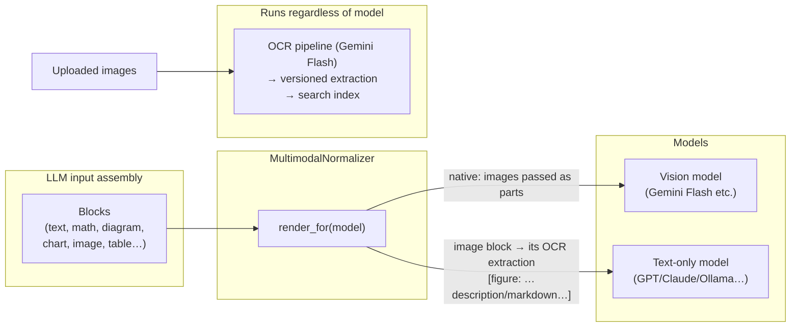

# 04 — AI Layer & Pipelines (LangChain / LangGraph)

## The OCR-first multimodal design (core requirement)

**Goal:** any pipeline must run with *any* model, including text-only models. Vision is an
optimization, never a dependency.



Two invariants make this work:

1. **Every image block carries an OCR extraction.** Ingestion (B-pipeline below) always
   produces a canonical markdown extraction for images/scans — stored, versioned, indexed.
   This is not optional: search, citations, and text-model support all depend on it.
2. **Pipelines are written against blocks, never against raw prompts.** `render_for(model)`
   serializes: vision models get native image parts (+ the OCR text as ground hint); text
   models get the OCR text substituted with a figure wrapper. Model choice becomes a config
   knob per task, swap-able at runtime.

## Model registry & routing

**No engine is hardcoded.** Providers, models, and per-task assignment are user-configured
in Settings (spec: [07-settings-providers-models.md](07-settings-providers-models.md)).
The registry is a thin cache over the `providers` / `models` / `task_assignments` tables;
`LLMGateway.get_model(task)` resolves task → model → provider (incl. keyring key) at call
time, following the fallback chain (assigned → fallback → error with deep-link to Settings).

```python
class ModelSpec(BaseModel):
    name: str                      # external model id
    provider: ProviderConfig       # type, base_url, keyring_ref
    caps: set[Cap]                 # {text, vision, tools, embeddings} — user-editable
    cost_in/out: float             # $/1M tokens — user-editable, feeds cost dashboard
    ctx: int
```

Out-of-box convenience only: a "suggested setup" button assigns a Gemini Flash mapping
(ocr / description / outline / quizgen / tutor / grade / chat / flashcards / notes_ocr)
once a Google provider is connected; embeddings default to local `bge-m3`
(sentence-transformers, offline & free), with any provider's embedding model as an option.

- Task requirements: `ocr` and `notes_ocr` **require vision** (UI blocks other choices);
  all other tasks accept text-only models — the normalizer substitutes OCR extractions
  for images, so any provider works (Ollama, OpenRouter, …).
- All calls go through one `LLMGateway`: retries (tenacity, exponential + jitter), timeout,
  response cache (key = provider + model + normalized prompt + input hashes), token/cost
  accounting into `ai_interactions`, budget enforcement.

## Why LangChain + LangGraph

- **LangGraph** state machines fit our multi-node flows (ingest, outline, quizgen with
  validate/repair loop, tutor with ladder policy, chat with tool loop): explicit state,
  checkpointing, conditional edges, per-node retries.
- **LangChain** supplies the provider-agnostic model interfaces, retrievers, structured
  output (`with_structured_output` onto Pydantic schemas), and tool calling — so the router
  above is trivial across vendors.
- Pipelines are plain code + graphs (no framework magic in domain logic); graphs are unit-
  testable with fake LLM nodes (LangGraph fakes / recorded fixtures).

## Pipelines

### P1 — Ingestion graph `ingest(material) → extraction[]`

Background job; WS progress events per stage/page.

```
detect → route:
  pdf_text    : PyMuPDF text layer; if text-density < threshold → pdf_ocr path
  pdf_ocr     : rasterize pages (300dpi) → per-page OCR (parallel, ≤N) → assemble
  image(group): optional preprocess (deskew/whiteboard cleanup) → per-image OCR
  docx/md/…   : native converter (P1)
→ ocr_node (Gemini Flash, structured output):
    markdown with LaTeX (math), Mermaid (detected diagrams/flows), GFM tables,
    per-region figure blocks (cropped image blob + caption + inline OCR),
    reading order, confidence per block
→ assemble → blocks JSON + flattened markdown (extraction version 1)
→ describe_node: index card (summary, topics, key terms, difficulty, reading time)
→ chunk + embed (local embeddings) → upsert FTS + vectors (same tx)
→ dedup check (phash / content hash) → done
```

OCR is a skill (`ocr.page`, doc 08) with a versioned template + contract; version is
logged per call. Pages are processed independently →
cheap retries, cache hits on re-upload.

### P2 — Notes/handwriting OCR `notes_ocr(drawing) → blocks`

Strokes → PNG → Gemini Flash → math-aware blocks (LaTeX for handwritten math, text md for
the rest). Strokes remain the source of truth; extraction re-runnable. Feeds answer
assessments and the chatbot's "latest notes" context.

### P3 — Outline & allocation graph `outline(course, materials) → chapter/section draft`

Map: per-material topics (from index cards) → Reduce: cluster into chapter/section tree
with per-section objectives → Allocate: map materials→sections with rationale + confidence
→ **human review UI** → commit (writes chapters/sections/section_materials). Never commits
blindly.

### P4 — Quiz generation graph `quizgen(section, config) → questions[]`

```
retrieve relevant chunks (hybrid BM25+vector, RRF)
→ blueprint node: question-type/difficulty/Bloom mix per config + section objectives
→ generate node: batched structured output (blocks stem/options/answer/explanation/
  sympy_check for math)
→ validator node (deterministic first!):
    • SymPy: expected answer parses; distractors NOT equivalent to expected;
      tolerance/units sane
    • contract checks (doc 08): count/type mix, citation of ≥1 chunk, bank dedup
      (embedding similarity > τ → regenerate)
    • **metadata completeness (doc 10): concepts, skill, bloom, difficulty,
      expected_time, source_refs, distractor→misconception map — a question
      enters the bank tagged or not at all**
    • schema + block lint (mermaid parses, latex renders)
→ repair loop (max 2) → persist questions (flagged ok|review)
```

### P5 — Tutor graph `tutor(step, student_answer, history) → hint`

```
parse answer (equation input → LaTeX; drawing → notes_ocr first)
→ deterministic check (SymPy equivalence chain / numeric tolerance)
   ├─ correct → confirm + why-it-worked, advance step
   └─ wrong → classify error (conceptual | procedural | arithmetic | misread;
              calculus taxonomy G10)
       → policy: hint_level = min(requested, ladder step, settings cap)
       → Socratic mode? → guiding question instead of statement
       → contract validate (tutor.hint): no answer-equivalent math in hint (doc-08
         no_answer_reveal), exact ladder level, length bounds → repair loop on violation
       → emit hint blocks; log to ai_interactions + step_attempts (audit + independence score)
       → optional: spawn micro-drill on repeated error pattern
```

Hint ladder levels: 1 clarify/restate · 2 nudge (relevant property) · 3 strategy outline ·
4 partial solution · 5 full worked solution. Level never auto-jumps; user requests each.

### P5b — Quiz-question help graph `quiz_help(question, attempt, mode) → hint | feedback`

Same tutor machinery scoped to a single quiz question (unified help taxonomy, D10):

```
mode = practice:
  hint ladder (levels 1–4 while attempt open; 5 gated post-submit or by settings)
  → same tutor.hint contract: no_answer_reveal, exact level, length bounds
  "Ask about this question" → sidebar chat with question + open attempt as context
  → chat skill runs under a no_answer_reveal wrapper until attempt submitted
mode = exam:
  all in-question help blocked (UI hides controls; API refuses, contract-enforced)
post-submit:
  feedback path (C9/C9b): explanation + distractor analysis; reveal restrictions lifted
all paths → ai_interactions + answers.audit (independence score)
```

### P6 — Grading graph `grade(answer, question)`

Order: SymPy/numeric deterministic → rubric LLM grading (only for free-form) → feedback
blocks with error tags → update mastery/mistakes. `graded_by` records the path.

Per-type routing:

- **equation / numeric / C18 handwritten**: parse confirmed LaTeX (see handwriting flow
  below) → equivalence chain → deterministic verdict.
- **composite C16**: each sub-part graded independently; **follow-through**: if part-a is
  wrong but part-b is correct *given the student's part-a value* (equivalence chain against
  re-parameterized expected), part-b scores its own marks with a "follow-through accepted,
  earlier error noted" annotation. Exam config may toggle follow-through off.
- **essay/proof C17**: rubric path only — rubric rows shown to the student upfront;
  margin-comment style feedback; `graded_by=llm`, never presented as deterministic.
- **table_fill C19**: per-cell deterministic check (value/equivalence/tolerance), partial
  credit per cell.
- **error_spot C20**: identification = step index selection; correction = equivalence
  chain vs the true corrected step; generation side validates the seeded flaw via
  step-verification (each adjacent line checked — the flaw must be the *only* break).
- **numberline/graph_plot C21 / G7 sketch**: geometric feature check (points, regions,
  key features) — deterministic where possible, flagged otherwise.

**Handwriting flow (C18)**: canvas strokes → `notes_ocr` → candidate LaTeX → UI renders
"interpreted as: [KaTeX]" confirmation chip → user edits LaTeX inline if misread →
submit → equivalence chain. Rule: **OCR never grades** — only confirmed LaTeX does;
original strokes stored on the answer for later re-OCR/debugging.

### P7 — Chat RAG graph `chat(session, message) → streamed blocks + citations`

```
context assembly: session history + auto-context (current section chunks,
active note, latest mistakes) 
→ retrieve (hybrid, course-scoped, rerank optional)
→ answer loop with tools: calc | sympy(solve/simplify/diff/int) | plot | course_search
→ stream tokens over WS
→ post: citation resolution (chunk → material → page/bbox for click-through),
  follow-ups (P2), usage log
```

Citation rule: assistant claims about *course material* must trace to retrieved chunks;
unretrieved claims get a "not from your material" marker (hallucination guard).

### P8 — Flashcards `flashcards(source: notes|material|mistakes, config) → cards[]`

Generate basic/cloze/reverse cards in blocks; dedup vs existing; enter FSRS scheduling.

### P9 — Notes actions `note_action(action, note) → blocks` — summarize / cleanup / explain / expand. Thin single-node graph, shared prompt registry.

## Math verification layer (calculus hardening)

Deterministic math correctness is the app's trust backbone for calculus and beyond. The
**equivalence chain** (used everywhere answers/steps/hints are compared):

```
check(student, expected):
  1. parse (LaTeX → SymPy; MathLive output normalized; units via pint)
  2. symbolic:   simplify(student − expected) == 0
  3. sampling:   evaluate both at N random domain-aware points → all-close
  4. structural: solveset(student) == solveset(expected)   (equations/inequalities)
  pass if ANY stage proves equivalence; stages 2–3 are the robust pair for calculus
  (simplify alone fails on many equivalent forms; sampling catches what it misses)
```

- **Step verification**: adjacent lines of a student's solution checked pairwise via the
  chain; failure localizes *which* step broke (feeds the tutor's error classification).
- **Calculus error taxonomy** (grows over time, seeded): missing chain-rule factor, wrong
  power rule, missing +C, u-substitution bounds not transformed, limit/continuity
  confusion, sign slips, dropped factors, notation misuse (dy/dx as fraction errors).
  Tutor classifies wrong answers against it → targeted hints and micro-drills (D8).
- **Hint-leak guard**: any emitted hint/feedback is checked against the expected answer
  with the same chain — hints containing answer-equivalent math are rejected
  (contract `no_answer_reveal`, doc 08).
- **Plot sanity**: sampled points from the equivalence stage double as a cheap
  plot-correctness check for generated figures (G3/G7).
- **Proof / "show that" questions**: outside deterministic scope → rubric path (P6),
  always flagged as LLM-graded.

## Prompt & evaluation governance

- Skills & prompts are **DB-backed and user-editable** (spec:
  [08-skills-and-prompts.md](08-skills-and-prompts.md)): system defaults seeded from
  `app/ai/skills/` code; user saves create versions with diff/rollback. Every
  `ai_interactions` row records the exact `skill_version_id`.
- **Golden-set evals** run in CI and on-demand. **Fixtures are real material from day one**:
  the author's own scanned math pages and worst handwriting photos, collected during
  Phases 0–1 (target: 20 pages + 10 handwriting samples) — synthetic samples may extend a
  set but never form the core, because they don't share the failure modes of real scans.
  - OCR: fixtures (scanned math page, whiteboard photo, diagram-heavy slide) → target
    edit-distance & LaTeX-AST match thresholds.
  - Quizgen: 10 section fixtures → validity rate (validators pass), difficulty sanity.
  - Grading: 30 (answer, expected) pairs incl. tricky equivalences → accuracy ≥ 98% on the
    deterministic path.
- Cost dashboard reads `ai_interactions`; per-task budget caps pause jobs with a notification.

## Failure modes & mitigations

| Risk | Mitigation |
|---|---|
| OCR cost blow-up on big PDFs | page-level caching, dedup, budget caps, "process first N pages" UI |
| Gemini rate limits | queue with concurrency cap, backoff, resume from failed page |
| Bad quiz answers slip through | validator + SymPy checks, flag `review`, one-click regenerate |
| Text-only model chosen for vision task | normalizer substitutes OCR — correct, degraded only on pure-image reasoning |
| Local model quality (offline mode) | router marks tasks "requires cloud" → UI badges degraded features |
