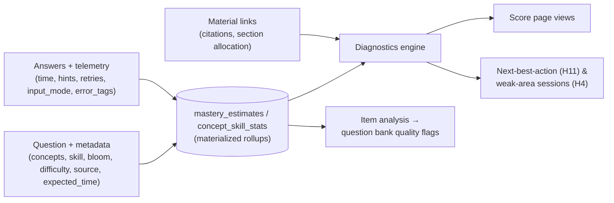

# 10 — Assessment, Scoring & Analytics

Everything measurable about learning lives here: what metadata every question carries,
what every attempt captures, the **Score page** (all tries, evaluations, deep metrics),
and the **diagnostics engine** that tells the user what to read and where to drill.



## 1. Question metadata taxonomy (required, validated)

Every generated or hand-made question is tagged before it enters the bank; the quizgen
contract rejects questions with incomplete metadata (a question that can't be analyzed is
a question that can't be used).

| Field | Type | Values / notes |
|---|---|---|
| `concept_ids` | FK[] → concepts | **primary analytic axis**; 1–3 concepts (atomic tagging enforced — more = flag) |
| `skill` | enum | `conceptual` (definitions, properties, why) · `procedural` (execute an algorithm) · `applied` (modeling, word problems, multi-concept) · `notation` (read/write formal notation) — the **second analytic axis** |
| `bloom` | enum | remember · understand · apply · analyze · evaluate · create |
| `difficulty` | float | 1–5, Elo-adjusted over time from real performance (seed = generator estimate) |
| `expected_time_sec` | int | generator estimate; item analysis corrects it (median real time) |
| `type` | enum | C1–C21 type (already in schema) |
| `curriculum_code` | str? | optional external mapping (textbook chapter, exam syllabus ref) for "exam coverage" views |
| `source_refs` | FK[] | chunks/materials the question was generated from — enables "re-read the source" actions |
| `error_tags_catalog` | — | *answers* carry error tags (below); question defines which are plausible (e.g. distractor → misconception mapping: each distractor may declare the misconception it detects — **rich signal: wrong choice = named misconception**) |
| `language`, `calc_allowed`, `units` | misc | practical flags |

Distractor-level misconception mapping (P4 quizgen generates it): choosing distractor C
on a chain-rule question maps to `missing_chain_factor` — the diagnostics engine then
counts misconceptions, not just wrong answers.

## 2. Answer & attempt telemetry (captured on every try)

On `answers`: `time_ms` (focus-time, pause-aware), `help_events` (already: hint levels,
ask-chat, socratic), `retries` (pre-submit edits in practice), `input_mode`,
`error_tags[]` (from grading: deterministic classification first — G10 taxonomy +
distractor misconceptions — LLM tag only for free-form), `confidence` (optional P2:
quick 1–3 self-rating before submit → calibration analysis).

On `attempts`: mode, started/finished, per-question timeline, device-ish context not
needed (single machine). All existing (score, meta) retained.

## 3. Score page (the analytics UI)

Entry from course + global ("Scores" in rail). Four tabs:

### 3.1 Overview
- **Mastery map**: course → chapter → concept rings (I20 visual language), trend sparkline
  per concept (last 30d), stale-concept indicators (mastery decaying / reviews overdue).
- **Rolling accuracy** (EWMA over last 20/50/100 answers, overall + per concept).
- **Level & XP** progress, streak, study-time distribution.
- **Difficulty-adjusted performance**: accuracy vs. average difficulty attempted —
  "80% on hard questions ≠ 80% on easy ones" (both shown, never blended silently).

### 3.2 History (all tries)
Every attempt/session: date, activity, mode, score ring, duration, avg time/question,
hint usage, independence score; expandable to **per-question rows** (your answer, verdict,
time, hints used, error tags, one-click → question & explanation re-open).
Filter by chapter/concept/type/date/mode; CSV/JSON export (H9).

### 3.3 Diagnostics (the "what am I bad at" view)
- **Weakness matrix**: concepts × skills heatmap (accuracy per cell, sample-size aware —
  low-n cells shown hatched, not red). Patterns readable at a glance: "procedural fine,
  conceptual weak on limits".
- **Error-pattern profile**: ranked G10/misconception tags by frequency + trend
  ("sign slips: 6 this week, ↓ from 9").
- **Speed–accuracy view**: per-concept scatter (fast+wrong = rushing; slow+wrong = struggling;
  slow+right = effortful) with quadrant labels.
- **Confidence calibration** (P2): stated vs. actual — overconfidence detector.
- **Exam coverage** (if `curriculum_code`s set): syllabus areas vs. mastery + attempts.

### 3.4 Recommendations
Generated by the engine below, each item actionable in one tap:
- **Read**: weak concept → linked material sections + specific chunks cited by failed
  questions ("Re-read §3.2 Chain rule — pages 41–44 (4 misses trace here)"), with read-status
  (B16) respected — never recommends the chapter you just studied unless mastery says so.
- **Drill**: generated micro-session spec (concept + skill + error tag + difficulty band),
  e.g. "10 procedural questions on u-substitution, difficulty 2–3, targeting
  `u_sub_bounds`".
- **Review**: due FSRS cards clustered by weak concept.
- **Challenge**: strong-but-stale concept → 1 mixed challenge quiz to confirm retention.
Each recommendation shows **why** (evidence line with the underlying numbers) — never
opaque.

## 4. Metrics catalog (computed definitions)

**Performance**: accuracy (raw), accuracy (partial-credit weighted), rolling accuracy,
difficulty-adjusted accuracy (vs. item difficulty), mastery estimate (existing BKT/Elo
hybrid, H1), follow-through rate (composites), per-type accuracy.

**Behavior**: time-per-question (vs. expected_time), hint dependency rate (per level),
independence score (existing), retry rate, input-mode usage (typed vs written), reading
completion (B16).

**Quality (item analysis, feeds C15 + bank)**: p-correct, discrimination index (high/low
scorer split), avg time vs expected, distractor efficiency (each option's selection rate —
dead distractors → regeneration candidate), N-attempts before retirement. Items with
p-correct outside [0.1, 0.95] after N≥20 or negative discrimination auto-flag `review`.

**Engagement**: streaks, daily-goal hit rate, session frequency/length, XP, quiz-vs-read
ratio.

All metrics defined once in `services/metrics.py` (single source of truth), materialized
nightly + on-demand into rollup tables; the Score page never computes over raw answers at
render time.

## 5. Diagnostics engine (weakness → recommendation)

```
per concept × skill cell:
  weakness_score = w1·(1 − mastery) + w2·(1 − rolling_accuracy)
                 + w3·error_tag_recurrence + w4·staleness + w5·(overdue_reviews)
  confidence = f(sample size, recency of evidence)   — low-n → "not enough data yet",
  never a fake verdict
ranking → top cells → template a recommendation (read / drill / review / challenge)
→ evidence line ("6 misses, 4 = missing_chain_factor, last seen 3d ago")
→ emitted to: Score page 3.4, Today screen next-best-action (H11), weak-area sessions (H4)
```

Read-vs-drill decision: conceptual weakness → read first (material linked via
`source_refs` + section allocation), procedural weakness → drill first, notation weakness
→ mini practice set; applied weakness → composite exercise (C16) recommendation.

## 6. Schema additions (doc 03)

```
questions:        + concept_ids(json FK[]), skill, bloom (move from loose tags),
                  expected_time_sec, curriculum_code, source_refs(json),
                  distractor_misconceptions(json: option → error_tag)
answers:          + time_ms, retries, error_tags(json), confidence (nullable)
concept_skill_stats: concept_id, skill, n, accuracy, rolling_accuracy, mastery,
                  last_seen_at, weakness_score, confidence  (materialized)
daily_rollups:    date, profile_id, course_id, answers_n, accuracy, time_min, xp,
                  goal_hit  (materialized; drives heatmap/dashboard cheaply)
item_stats:       question_id, p_correct, discrimination, avg_time_ms,
                  distractor_selection(json), n_attempts, flag
```

## 7. Roadmap placement

- Question metadata + telemetry fields: schema from Phase 1, enforced by quizgen contract
  Phase 4 (questions enter the bank tagged or not at all).
- History tab + basic overview: Phase 4 (with the first quizzes — a score page with one
  attempt is still the right skeleton).
- Item analysis + weakness matrix + recommendations v1: Phase 7 (needs volume).
- Confidence calibration & exam coverage: P2.
